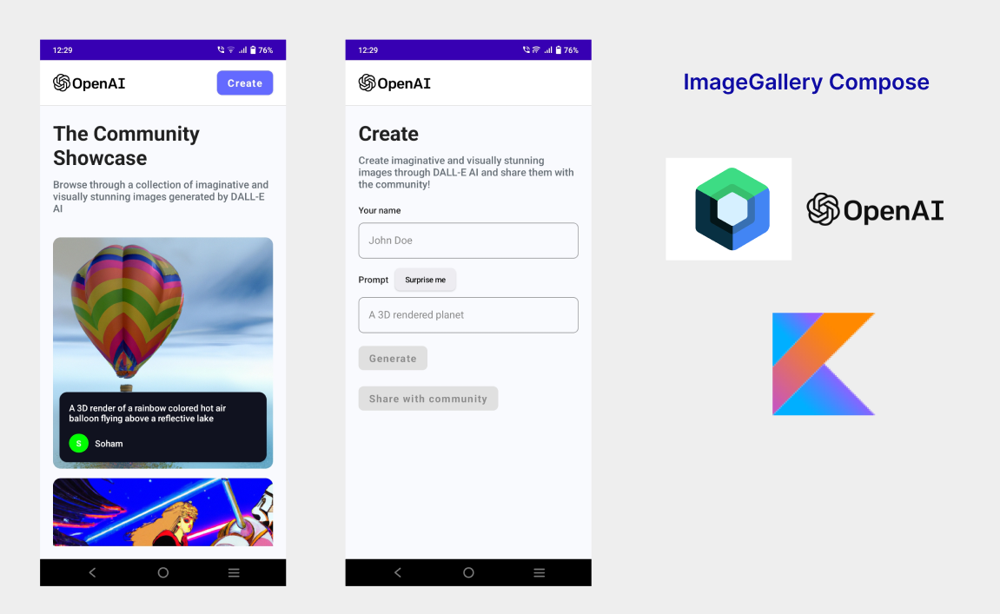

# ImageGallery-Compose
Simple ImageGallery app built by using OpenAI's Dall-E-AI api, MVVM &amp; JetPack Compose

## About
ImageGallery Compose is a sample Image Gallery app where you can see images created by DALL-E-AI also you can generate images by writing prompts.

## Built With 
- [Dall-E-AI](https://openai.com/dall-e-2/) - DALL·E 2 is a new AI system that can create realistic images and art from a description in natural language.
  (I'm using APIs which are created by one of my friend Soham. He has created APIs which uses DALL-E-AI api to create images and store in the database.
  You can check his repository [Dall-E-AI api](https://github.com/Soham-2224/DALL-E_clone))

- [Jetpack Compose](https://developer.android.com/jetpack/compose) - Jetpack Compose is Android’s modern toolkit for building native UI.

- [Kotlin](https://kotlinlang.org/) - First class and official programming language for Android development.

- [Coroutines](https://kotlinlang.org/docs/reference/coroutines-overview.html) - For asynchronous and more..

- [MutableState](https://developer.android.com/jetpack/compose/state) - MutableState is an alternative to using LiveData or Flow. 

- [Android Architecture Components](https://developer.android.com/topic/libraries/architecture) - Collection of libraries that help you design robust, testable, and maintainable apps.

  - [ViewModel](https://developer.android.com/topic/libraries/architecture/viewmodel) - Stores UI-related data that isn't destroyed on UI changes.

- [Dependency Injection](https://developer.android.com/training/dependency-injection) -
  - [Hilt-Dagger](https://dagger.dev/hilt/) - Standard library to incorporate Dagger dependency injection into an Android application.

  - [Hilt-ViewModel](https://developer.android.com/training/dependency-injection/hilt-jetpack) - DI for injecting `ViewModel`.

- [Material Components for Android](https://github.com/material-components/material-components-android) - Modular and customizable Material Design UI components for Android.

- [Coil](https://coil-kt.github.io/coil/compose/) - An image loading library for Android backed by Kotlin Coroutines.

# Package Structure

    dev.abhaycloud.imagegallerycompose     # Root Package
    
    ├── api                 # Retrofit API for remote end point
    |
    ├── di                  # Dependency Injection
    │ 
    |── model               # Model classes
    |
    |── repository          # Single source of data
    |
    ├── ui
    |   ├── theme           # Manage Themes: Color, Shape, Theme and Type.
    │   ├── home            # HomeScreen composable & viewModel
    │   ├── create          # CreateScreen composable & viewModel
    |   ├── navigation      # Navigating with Compose 
    |
    └── utils               # Utility Classes
    
## Architecture
This app uses [***MVVM (Model View View-Model)***](https://developer.android.com/jetpack/docs/guide#recommended-app-arch) architecture.

## Contribute
This app is in under development. There are few things that needs to get fixed. If you want to contribute to this app, you're always welcome! 

## LICENSE
Project is published under the Apache 2.0 license. Feel free to clone and modify repository as you want, but don't forget to add reference to authors.

## Connect with me
If you have any difficulty then just message me on Instagram or LinkedIn.

